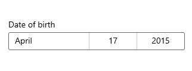

<!-- Class syntax.
public class DatePicker : Windows.UI.Xaml.Controls.Control, Windows.UI.Xaml.Controls.IDatePicker, Windows.UI.Xaml.Controls.IDatePicker2
-->

# Microsoft.UI.Xaml.Controls.DatePicker

## -description
Represents a control that allows a user to pick a date value.

## -xaml-syntax
```xaml
<DatePicker .../>

```

## -remarks

Use a `DatePicker` to let a user enter a date value. The user picks the date using [ComboBox](combobox.md) selection for month, day, and year values. You can customize the `DatePicker` in various ways to suit your app.



For more info, design guidance, and code examples, see [Date picker](/windows/apps/design/controls/date-picker).

The `DatePicker` supports each of the calendar systems supported by Windows. These calendars are specified in the [Windows.Globalization.CalendarIdentifiers](/uwp/api/windows.globalization.calendaridentifiers) class. The `DatePicker` uses the correct calendar for your app's default language, or you can set the [CalendarIdentifier](datepicker_calendaridentifier.md) property to use a specific calendar system.

### Formatting the date picker

By default, the date picker shows the day, month, and year. If your scenario for the date picker doesn't require all the fields, you can hide the ones you don't need. To hide a field, set its corresponding *field*Visible property to `false`. For more info, see the [DayVisible](datepicker_dayvisible.md), [MonthVisible](datepicker_monthvisible.md), and [YearVisible](datepicker_yearvisible.md) properties.

The string content of each `ComboBox` in the `DatePicker` is created by a [DateTimeFormatter](/uwp/api/windows.globalization.datetimeformatting.datetimeformatter). You can use a string that is either a *format template* or a *format pattern* to specify the format. For more info, see the [DayFormat](datepicker_dayformat.md), [MonthFormat](datepicker_monthformat.md), and [YearFormat](datepicker_yearformat.md) properties.

### Date values

The date picker control has both [Date](datepicker_date.md) / [DateChanged](datepicker_datechanged.md) and [SelectedDate](datepicker_selecteddate.md) / [SelectedDateChanged](datepicker_selecteddatechanged.md) APIs. The difference between these is that `Date` is not nullable, while `SelectedDate` is nullable.

The value of `SelectedDate` is used to populate the date picker and is `null` by default. If `SelectedDate` is `null`, the `Date` property is set to 12/31/1600; otherwise, the `Date` value is synchronized with the `SelectedDate` value. When `SelectedDate` is `null`, the picker is 'unset' and shows the field names instead of a date.


To use the date value in your app, you typically use a data binding to the `SelectedDate` property, or handle the `SelectedDateChanged` event.

You can set the [MinYear](datepicker_minyear.md) and [MaxYear](datepicker_maxyear.md) properties to restrict the date values in the picker. By default, `MinYear` is set to 100 years prior to the current date and `MaxYear` is set to 100 years past the current date.

If you set only `MinYear` or `MaxYear`, you need to ensure that a valid date range is created by the date you set and the default value of the other date; otherwise, no date will be available to select in the picker. For example, setting only `yearDatePicker.MaxYear = new DateTimeOffset(new DateTime(900, 1, 1));` creates an invalid date range with the default value of `MinYear`.

#### Initializing a date value

The date properties can't be set as a XAML attribute string, because the Windows Runtime XAML parser doesn't have a conversion logic for converting strings to dates as [DateTime](/uwp/api/windows.foundation.datetime) / [DateTimeOffset](/dotnet/api/system.datetimeoffset?view=dotnet-uwp-10.0&preserve-view=true) objects.

This example demonstrates setting the `SelectedDate` property in code.

```xaml
<DatePicker x:Name="myDatePicker"/>
```

```csharp
public MainPage()
{
    this.InitializeComponent();
    myDatePicker.SelectedDate = new DateTimeOffset(new DateTime(1950, 1, 1));
}
```

### DateTime and Calendar values

The date objects used in a DatePicker have a different representation depending on your programming language. C# and Visual Basic use the [System.DateTimeOffset](/dotnet/api/system.datetimeoffset?view=dotnet-uwp-10.0&preserve-view=true) structure that is part of .NET. Visual C++ component extensions (C++/CX) uses the [Windows::Foundation::DateTime](/windows/desktop/api/windows.foundation/ns-windows-foundation-datetime) structure. A related concept is the **Calendar** class, which influences how dates are interpreted in context. All Windows Runtime apps can use the [Windows.Globalization.Calendar](/uwp/api/windows.globalization.calendar) class. C# and Visual Basic apps can alternatively use the [System.Globalization.Calendar](/dotnet/api/system.globalization.calendar?view=dotnet-uwp-10.0&preserve-view=true) class, which has very similar functionality. (Windows Runtime app can use the base .NET [Calendar](/dotnet/api/system.globalization.calendar?view=dotnet-uwp-10.0&preserve-view=true) class but not the specific implementations for example **GregorianCalendar**.)

.NET also supports a type named [DateTime](/dotnet/api/system.datetime?view=dotnet-uwp-10.0&preserve-view=true), which is implicitly convertible to a [DateTimeOffset](/dotnet/api/system.datetimeoffset?view=dotnet-uwp-10.0&preserve-view=true). So you might see a "DateTime" type being used in .NET code that's used to set values that are really [DateTimeOffset](/dotnet/api/system.datetimeoffset?view=dotnet-uwp-10.0&preserve-view=true). For more info on the difference between [DateTime](/dotnet/api/system.datetime?view=dotnet-uwp-10.0&preserve-view=true) and [DateTimeOffset](/dotnet/api/system.datetimeoffset?view=dotnet-uwp-10.0&preserve-view=true), see Remarks in [DateTimeOffset](/dotnet/api/system.datetimeoffset?view=dotnet-uwp-10.0&preserve-view=true).

### Control style and template

You can modify the default [Style](../microsoft.ui.xaml/style.md) and [ControlTemplate](controltemplate.md) to give the control a unique appearance. For information about modifying a control's style and template, see [XAML styles](/windows/apps/design/style/xaml-styles). XAML also includes resources that you can use to modify the colors of a control in different visual states without modifying the control template. Modifying these resources is preferred to setting properties such as [Background](control_background.md) and [Foreground](control_foreground.md). For more info, see the [Light-weight styling](/windows/apps/design/style/xaml-styles#lightweight-styling) section of the [XAML styles](/windows/apps/design/style/xaml-styles) article.

The resources for this control are listed in the [ThemeDictionaries](/windows/apps/design/style/xaml-theme-resources) section of the [DatePicker_themeresources.xaml](https://github.com/microsoft/microsoft-ui-xaml/blob/main/dev/CommonStyles/DatePicker_themeresources.xaml) file on GitHub. The `ResourceKey` value for each `StaticResource` references a brush and color in the [Common_themeresources_any.xaml](https://github.com/microsoft/microsoft-ui-xaml/blob/main/dev/CommonStyles/Common_themeresources_any.xaml) file.
## -examples

> [!TIP]
> For more info, design guidance, and code examples, see [Date Picker](/windows/apps/design/controls/date-picker).

> [!div class="nextstepaction"]
> [Open the WinUI 3 Gallery app and see the DatePicker in action](winui3gallery:/item/DatePicker).

> The **WinUI 3 Gallery** app includes interactive examples of most WinUI 3 controls, features, and functionality. Get the app from the [Microsoft Store](https://www.microsoft.com/store/productId/9P3JFPWWDZRC) or get the source code on [GitHub](https://github.com/microsoft/WinUI-Gallery)


This example shows how to create a simple date picker with a header.

```xaml
<DatePicker x:Name="birthDatePicker" Header="Date of birth"/>
```

```csharp
DatePicker birthDatePicker = new DatePicker()
{
    Header = "Date of birth"
};
```

## -see-also

[Date picker](/windows/apps/design/controls/date-picker), [Windows.Globalization.CalendarIdentifiers](/uwp/api/windows.globalization.calendaridentifiers), [System.DateTimeOffset (C#/VB)](/dotnet/api/system.datetimeoffset?view=dotnet-uwp-10.0&preserve-view=true), [Windows::Foundation::DateTime (C++)](/windows/desktop/api/windows.foundation/ns-windows-foundation-datetime), [Windows.Globalization.Calendar](/uwp/api/windows.globalization.calendar), [TimePicker](timepicker.md), [Controls list](/windows/apps/design/controls/)
