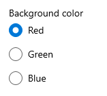

# Microsoft.UI.Xaml.Controls.RadioButtons

<!--
public class RadioButtons : Windows.UI.Xaml.Controls.Control
-->

## -description

Represents a control that shows a group of related options from which one can be selected.

## -remarks

> For more info, design guidance, and code examples, see [Radio buttons](/windows/apps/design/controls/radio-button).

Use radio buttons, also called option buttons, to let users select one option from a collection of two or more mutually exclusive, but related, options. Radio buttons are always used in groups, and each option is represented by one radio button in the group.

The `RadioButtons` control simplifies layout, handles keyboard navigation and accessibility, and supports binding to a data source. When you use RadioButtons, you can treat your group of options as a single entity, rather than keeping track of individual [RadioButton](/uwp/api/Windows.UI.Xaml.Controls.RadioButton) controls.

The `RadioButtons` control uses a content model similar to an [ItemsControl](/uwp/api/windows.ui.xaml.controls.itemscontrol). This means that you can:

- Populate it by adding items directly to the [Items](radiobuttons_items.md) collection or by binding data to its [ItemsSource](radiobuttons_itemssource.md) property.
- Use the [SelectedIndex](radiobuttons_selectedindex.md) or [SelectedItem](radiobuttons_selecteditem.md) properties to get and set which option is selected.
- Handle the [SelectionChanged](radiobuttons_selectionchanged.md) event to take action when an option is chosen.

### Control style and template

You can modify the default [Style](../microsoft.ui.xaml/style.md) and [ControlTemplate](controltemplate.md) to give the control a unique appearance. For information about modifying a control's style and template, see [XAML styles](/windows/apps/design/style/xaml-styles). The default style, template, and resources that define the look of the control are included in the `generic.xaml` file. For design purposes, `generic.xaml` is installed with the Windows App SDK NuGet package. By default, this location is `\Users\<username>\.nuget\packages\microsoft.windowsappsdk\<version>\lib\uap10.0\Microsoft.UI\Themes\generic.xaml`. Styles and resources from different versions of the SDK might have different values.

XAML also includes resources that you can use to modify the colors of a control in different visual states without modifying the control template. Modifying these resources is preferred to setting properties such as [Background](control_background.md) and [Foreground](control_foreground.md). For more info, see the [Light-weight styling](/windows/apps/design/style/xaml-styles#lightweight-styling) section of the [XAML styles](/windows/apps/design/style/xaml-styles) article.

## -see-also

[Radio buttons](/windows/apps/design/controls/radio-button)

## -examples

> [!TIP]
> For more info, design guidance, and code examples, see [Radio buttons](/windows/apps/design/controls/radio-button).

> [!div class="nextstepaction"]
> [Open the WinUI 3 Gallery app and see RadioButtons in action](winui3gallery:/item/RadioButtons).

> The **WinUI 3 Gallery** app includes interactive examples of most WinUI 3 controls, features, and functionality. Get the app from the [Microsoft Store](https://www.microsoft.com/store/productId/9P3JFPWWDZRC) or get the source code on [GitHub](https://github.com/microsoft/WinUI-Gallery).
