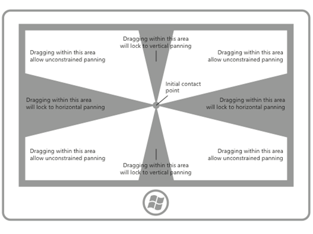

# Microsoft.UI.Xaml.Controls.ScrollView.HorizontalScrollRailMode

<!--
public Microsoft.UI.Xaml.Controls.ScrollingRailMode HorizontalScrollRailMode { get; set; }
-->

## -description

Gets or sets a value that indicates whether the scroll rail is enabled for the horizontal axis.

## -property-value

A value that indicates whether the scroll rail is enabled for the horizontal axis. The default is `Enabled`.

## -remarks

When content is scrolled without manipulating the scrollbar directly, for example, by touch, we call it panning. Because content can be both wider and taller than the display area, two-dimensional panning (horizontal and vertical) is often necessary. _Rails_ improve the user experience in these cases by locking the panning to the axis of motion, either vertical or horizontal, as if the content were on a rail.

The following diagram demonstrates the concept of rails.

For more info, see [Guidelines for panning](/windows/apps/design/input/guidelines-for-panning).

## -see-also

## -examples

