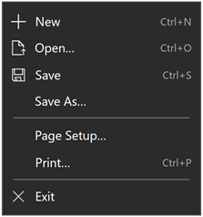

<!-- Property syntax.
public IVector<KeyboardAccelerator> KeyboardAccelerators { get; }
-->

# Microsoft.UI.Xaml.UIElement.KeyboardAccelerators

## -description

Gets the collection of key combinations that invoke an action using the keyboard.

Accelerators are typically assigned to buttons or menu items.

<br/>
*Example of a menu showing keyboard accelerators for various menu items*

## -property-value

The collection of [**KeyboardAccelerator**](../microsoft.ui.xaml.input/keyboardaccelerator.md) objects.

## -remarks

As keyboard accelerators are not typically described directly in the UI of your application, you can improve discoverability through [tooltips](/windows/apps/design/controls/tooltips), which display automatically when the user moves focus to, presses and holds, or hovers the mouse pointer over a control. The tooltip can identify whether a control has an associated keyboard accelerator and, if so, what the accelerator key combination is.

Windows 10, version 1703, introduced keyboard accelerator shortcuts. However, these shortcuts were not displayed with the UI of their corresponding controls.

Starting with Windows 10, version 1803, when KeyboardAccelerators are declared, controls present the corresponding key combinations by default in a tooltip (unless they are associated with [MenuFlyoutItem](../microsoft.ui.xaml.controls/menuflyoutitem.md) and [ToggleMenuFlyoutItem](../microsoft.ui.xaml.controls/togglemenuflyoutitem.md) objects).

> [!NOTE]
> Specifying a tooltip overrides this behavior.

For [MenuFlyoutItem](../microsoft.ui.xaml.controls/appbarbutton.md) and [ToggleMenuFlyoutItem](../microsoft.ui.xaml.controls/togglemenuflyoutitem.md) objects, the keyboard accelerator is displayed with the flyout text.

If a control has more than one accelerator defined, the first registered accelerator is presented.

Depending on the control, you can override the default key combination string associated with a [keyboard accelerator using text override properties. See[MenuFlyoutItem.KeyboardAcceleratorTextOverride](../microsoft.ui.xaml.controls/menuflyoutitem_keyboardacceleratortextoverride.md), [AppBarButton.KeyboardAcceleratorTextOverride](../microsoft.ui.xaml.controls/appbarbutton_keyboardacceleratortextoverride.md), and [AppBarToggleButton.KeyboardAcceleratorTextOverride](../microsoft.ui.xaml.controls/appbartogglebutton_keyboardacceleratortextoverride.md).

An accelerator key can be a single key, such as F1 - F12 and Esc, or a combination of keys (Ctrl + Shift + B, or Ctrl C) that invoke a command. They differ from access keys (mnemonics), which are typically modified with the Alt key and simply activate a command or control.

An accelerator can be executed even if the element associated with the accelerator is not visible. For example, an item in the [CommandBar.SecondaryCommands](../microsoft.ui.xaml.controls/commandbar_secondarycommands.md) collection of the [CommandBar](../microsoft.ui.xaml.controls/commandbar.md) can be invoked using an accelerator without expanding the overflow menu and displaying the element.

By default, an accelerator has global scope. However, you can constrain scope using [KeyboardAccelerator.ScopeOwner](../microsoft.ui.xaml.input/keyboardaccelerator_scopeowner.md) or disable an accelerator completely using [KeyboardAccelerator.IsEnabled](../microsoft.ui.xaml.input/keyboardaccelerator_isenabled.md).

## -examples

Here we specify keyboard accelerators for a set of buttons (we specify a tooltip for `Button1`, which overrides the default keyboard accelerator display behavior).

```xaml
<StackPanel x:Name="Container" Grid.Row="0" Background="AliceBlue">
    <Button Content="Button1" Margin="20"
            KeyboardAcceleratorPlacementMode="Auto"
            ToolTipService.ToolTip="Tooltip">
        <Button.KeyboardAccelerators>
            <KeyboardAccelerator  Key="A" Modifiers="Windows"/>
        </Button.KeyboardAccelerators>
    </Button>
    <Button Content="Button2"  Margin="20"
            KeyboardAcceleratorPlacementMode="Auto">
        <Button.KeyboardAccelerators>
            <KeyboardAccelerator  Key="B" Modifiers="Windows"/>
        </Button.KeyboardAccelerators>
    </Button>
    <Button Content="Button3"  Margin="20"
            KeyboardAcceleratorPlacementMode="Auto">
        <Button.KeyboardAccelerators>
            <KeyboardAccelerator  Key="C" Modifiers="Windows"/>
        </Button.KeyboardAccelerators>
    </Button>
</StackPanel>
```

In this example, we specify keyboard accelerators for a set of `MenuFlyoutItem` and `ToggleMenuFlyoutItem` objects. The keyboard accelerator is displayed in the control's flyout.

```xaml
<AppBarButton AccessKey="R" Icon="Refresh" Label="Refresh" IsAccessKeyScope="True">
    <AppBarButton.Flyout>
        <MenuFlyout>
            <MenuFlyoutItem AccessKey="A" Icon="Refresh" Text="Refresh A">
                <MenuFlyoutItem.KeyboardAccelerators>
                    <KeyboardAccelerator Key="R" Modifiers="Control"/>
                </MenuFlyoutItem.KeyboardAccelerators>
            </MenuFlyoutItem>
            <MenuFlyoutItem AccessKey="B" Icon="Globe" Text="Refresh B" />
            <MenuFlyoutItem AccessKey="C" Icon="Globe" Text="Refresh C" />
            <MenuFlyoutItem AccessKey="D" Icon="Globe" Text="Refresh D" />
            <ToggleMenuFlyoutItem AccessKey="E" Icon="Globe" Text="ToggleMe">
                <MenuFlyoutItem.KeyboardAccelerators>
                    <KeyboardAccelerator Key="Q" Modifiers="Control"/>
                </MenuFlyoutItem.KeyboardAccelerators>
            </ToggleMenuFlyoutItem>
        </MenuFlyout>
    </AppBarButton.Flyout>
</AppBarButton>
```

Control the presentation behavior by using the [KeyboardAcceleratorPlacementMode](uielement_keyboardacceleratorplacementmode.md) property, which accepts two values: [Auto](../microsoft.ui.xaml.input/keyboardacceleratorplacementmode.md) or [Hidden](../microsoft.ui.xaml.input/keyboardacceleratorplacementmode.md).

```xaml
<Button Content="Save" Click="OnSave" KeyboardAcceleratorPlacementMode="Auto">
    <Button.KeyboardAccelerators>
        <KeyboardAccelerator Key="S" Modifiers="Control" />
    </Button.KeyboardAccelerators>
</Button>
```

In some cases, you might need to present a tooltip relative to another element (typically a container object).

Here, we show how to use the `KeyboardAcceleratorPlacementTarget` property to display the keyboard accelerator key combination for a Save button with the `Grid` container instead of the button.

```xaml
<Grid x:Name="Container" Padding="30">
  <Button Content="Save"
    Click="OnSave"
    KeyboardAcceleratorPlacementMode="Auto"
    KeyboardAcceleratorPlacementTarget="{x:Bind Container}">
    <Button.KeyboardAccelerators>
      <KeyboardAccelerator  Key="S" Modifiers="Control" />
    </Button.KeyboardAccelerators>
  </Button>
</Grid>
```

## -see-also

[Keyboard Accelerators](/windows/apps/design/input/keyboard-accelerators)
